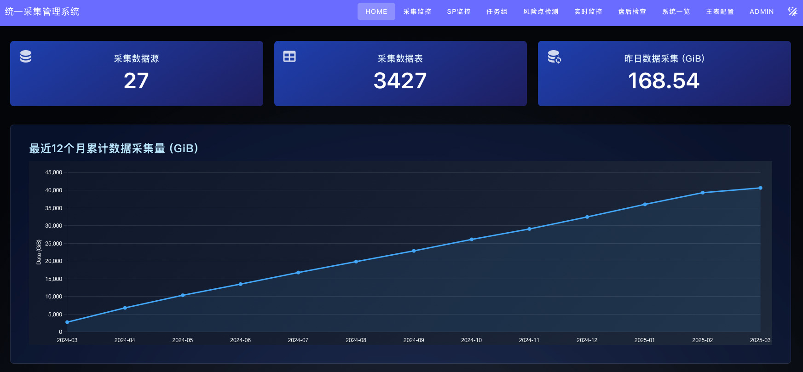
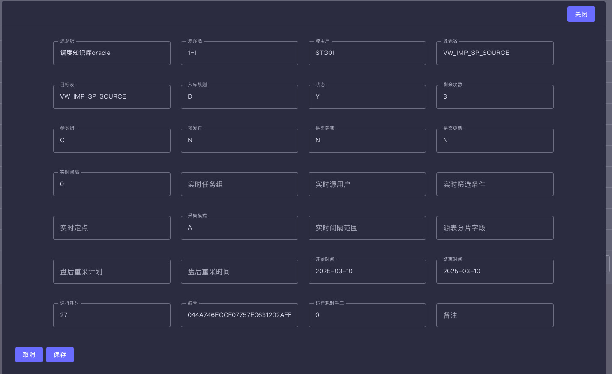
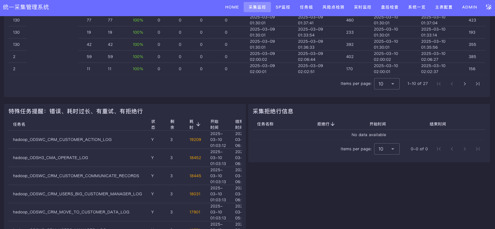

# Addax UI - ETL 数据管理前端

**本项目已经合并到后端项目一起**，请移步到[frontend](https://github.com/wgzhao/addax-admin/frontend)

[](https://opensource.org/licenses/Apache-2.0)
[](https://vuejs.org/)
[](https://vuetifyjs.com/)
[](https://www.typescriptlang.org/)

[English](README_EN.md) | 中文

## 📖 项目简介

Addax UI 是一个基于 Vue 3 + Vuetify 开发的现代化 ETL 数据管理前端系统，为 Addax 数据同步工具提供了直观易用的 Web 管理界面。

### 完整 ETL 解决方案

本项目是完整 ETL 管理解决方案的一部分，由三个核心项目组成：

- **[Addax](https://github.com/wgzhao/addax)** - 高性能的 ETL 数据同步引擎
- **[Addax Admin](https://github.com/wgzhao/addax-admin)** - ETL 管理后端服务
- **[Addax UI](https://github.com/wgzhao/addax-ui)** - ETL 管理前端界面（本项目）

## ✨ 主要功能

- 🚀 **实时监控** - 可视化 ETL 任务执行状态和性能指标
- 📊 **任务管理** - 创建、编辑、调度和监控 ETL 任务
- 🔍 **数据源管理** - 支持多种数据源的连接和配置
- 📋 **字段映射** - 可视化源表和目标表字段映射与对比
- 📈 **性能分析** - 详细的任务执行报告和性能分析
- 🔐 **权限控制** - 基于角色的用户权限管理
- 📱 **响应式设计** - 支持桌面端和移动端访问

## 🛠️ 技术栈

- **前端框架**: Vue 3 (Composition API)
- **UI 组件库**: Vuetify 3
- **开发语言**: TypeScript
- **状态管理**: Pinia
- **路由**: Vue Router 4
- **构建工具**: Vite
- **图表库**: Chart.js + Vue Chart.js
- **HTTP 客户端**: Axios
- **代码规范**: ESLint + Prettier

## 📦 快速开始

### 环境要求

- Node.js >= 16.0.0
- npm >= 8.0.0 或 yarn >= 1.22.0

### 安装依赖

```bash
# 克隆项目
git clone https://github.com/wgzhao/addax-ui.git
cd addax-ui

# 安装依赖
npm install
# 或使用 yarn
yarn install
```

### 开发环境

```bash
# 启动开发服务器
npm run dev
# 或
yarn dev
```

访问 [http://localhost:3030](http://localhost:3030) 查看应用。

### 生产构建

```bash
# 构建生产版本
npm run build
# 或
yarn build

# 预览生产构建
npm run preview
# 或
yarn preview
```

## 🎯 项目结构

```text
addax-ui/
├── src/
│   ├── components/        # 可复用组件
│   │   ├── dashboard/     # 仪表板组件
│   │   ├── dataservice/   # 数据服务组件
│   │   ├── datasource/    # 数据源组件
│   │   ├── ods/          # ODS 相关组件
│   │   └── sp/           # 存储过程组件
│   ├── layouts/          # 布局组件
│   ├── router/           # 路由配置
│   ├── service/          # API 服务
│   ├── stores/           # Pinia 状态管理
│   ├── types/            # TypeScript 类型定义
│   ├── utils/            # 工具函数
│   └── views/            # 页面组件
├── public/               # 静态资源
└── screenshots/          # 项目截图
```

## 🖼️ 界面截图

### 主控制台


*实时显示 ETL 任务状态和系统概览*

### 任务配置


*ODS 表配置界面，支持表单验证和实时预览*

### 实时监控


*实时任务监控面板，显示任务执行状态和性能指标*

### 字段对比


*可视化对比源表和目标表字段，包括字段名、数据类型等*

## 🔧 配置说明

### 环境变量

在项目根目录创建 `.env.local` 文件：

```bash
# API 基础路径
VITE_API_BASE_URL=/api

# 后端服务地址
VITE_API_HOST=http://localhost:8080
```

### 开发配置

项目使用 Vite 作为构建工具，主要配置在 `vite.config.mts` 中：

- 开发服务器端口：3030
- 自动代理 API 请求到后端服务
- 支持 TypeScript 和 Vue SFC
- 集成 Vuetify 主题系统

## 🤝 贡献指南

我们欢迎所有形式的贡献！请遵循以下步骤：

1. Fork 本项目
2. 创建特性分支 (`git checkout -b feature/AmazingFeature`)
3. 提交更改 (`git commit -m 'Add some AmazingFeature'`)
4. 推送到分支 (`git push origin feature/AmazingFeature`)
5. 创建 Pull Request

### 代码规范

项目使用 ESLint 和 Prettier 确保代码质量：

```bash
# 代码检查
npm run lint

# 代码格式化
npm run format
```

## 📄 许可证

本项目基于 [Apache License 2.0](LICENSE) 开源协议。

## 👨‍💻 作者

**wgzhao** - [GitHub](https://github.com/wgzhao) | [Email](mailto:wgzhao@gmail.com)

## 🙏 致谢

- 感谢 [Vue.js](https://vuejs.org/) 团队提供的优秀前端框架
- 感谢 [Vuetify](https://vuetifyjs.com/) 提供的精美 Material Design 组件
- 感谢所有为项目贡献代码和建议的开发者
