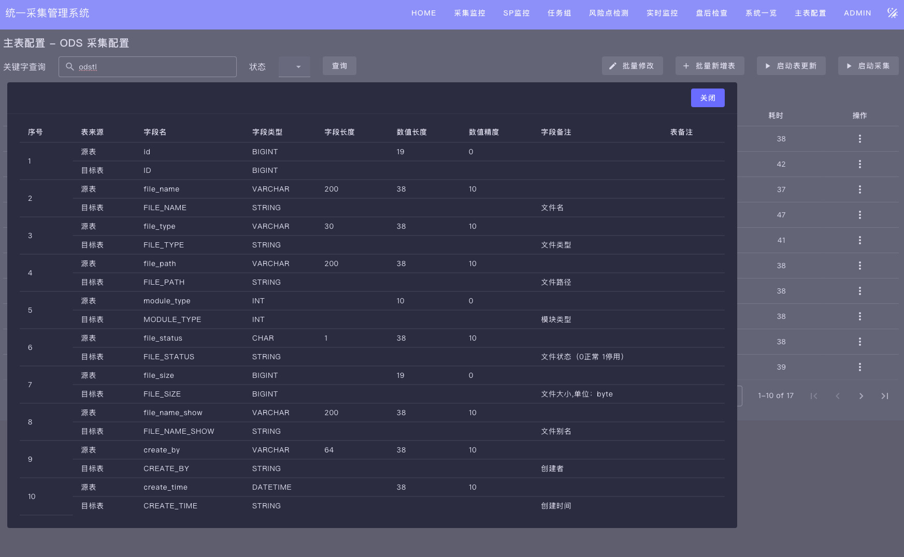

# ETL Management

The complete ETL management solution. It is composed of three projects:

- [Addax](https://github.com/wgzhao/addax) The ETL core program
- [Addax Admin](https://github.com/wgzhao/addax-admin) The ETL management backend
- [Addax UI](https://github.com/wgzhao/addax-ui) The ETL management frontend

## Screenshots

Here are some screenshots of the application interface:

*Main dashboard showing ETL pipeline status*

*ODS table configuration interface with form validation*

*Real-time task monitoring dashboard with status indicators*

*Visually compare fields between source and destination tables, including names, data types, etc.*