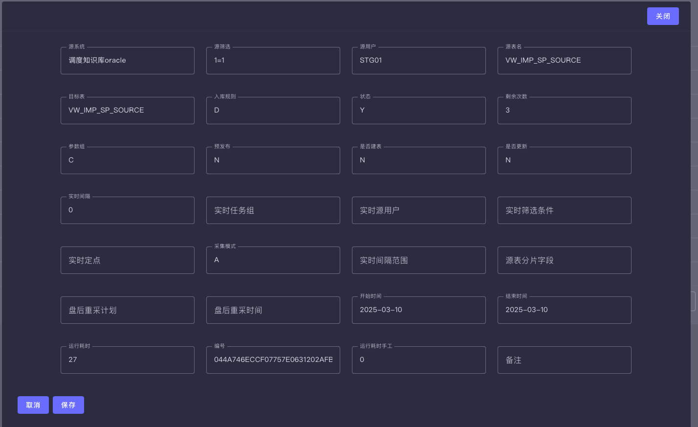

# Addax UI - ETL Data Management Frontend

[](https://opensource.org/licenses/Apache-2.0)
[](https://vuejs.org/)
[](https://vuetifyjs.com/)
[](https://www.typescriptlang.org/)

English | [中文](README.md)

## 📖 Overview

Addax UI is a modern ETL data management frontend system built with Vue 3 + Vuetify, providing an intuitive and user-friendly web management interface for the Addax data synchronization tool.

### Complete ETL Solution

This project is part of a complete ETL management solution consisting of three core projects:

- **[Addax](https://github.com/wgzhao/addax)** - High-performance ETL data synchronization engine
- **[Addax Admin](https://github.com/wgzhao/addax-admin)** - ETL management backend service
- **[Addax UI](https://github.com/wgzhao/addax-ui)** - ETL management frontend interface (this project)

## ✨ Features

- 🚀 **Real-time Monitoring** - Visualize ETL task execution status and performance metrics
- 📊 **Task Management** - Create, edit, schedule, and monitor ETL tasks
- 🔍 **Data Source Management** - Support for multiple data source connections and configurations
- 📋 **Field Mapping** - Visual source and target table field mapping and comparison
- 📈 **Performance Analysis** - Detailed task execution reports and performance analytics
- 🔐 **Access Control** - Role-based user permission management
- 📱 **Responsive Design** - Support for desktop and mobile access

## 🛠️ Tech Stack

- **Frontend Framework**: Vue 3 (Composition API)
- **UI Component Library**: Vuetify 3
- **Development Language**: TypeScript
- **State Management**: Pinia
- **Routing**: Vue Router 4
- **Build Tool**: Vite
- **Chart Library**: Chart.js + Vue Chart.js
- **HTTP Client**: Axios
- **Code Standards**: ESLint + Prettier

## 📦 Quick Start

### Prerequisites

- Node.js >= 16.0.0
- npm >= 8.0.0 or yarn >= 1.22.0

### Installation

```bash
# Clone the project
git clone https://github.com/wgzhao/addax-ui.git
cd addax-ui

# Install dependencies
npm install
# or use yarn
yarn install
```

### Development

```bash
# Start development server
npm run dev
# or
yarn dev
```

Visit [http://localhost:3030](http://localhost:3030) to view the application.

### Production Build

```bash
# Build for production
npm run build
# or
yarn build

# Preview production build
npm run preview
# or
yarn preview
```

## 🎯 Project Structure

```text
addax-ui/
├── src/
│   ├── components/        # Reusable components
│   │   ├── dashboard/     # Dashboard components
│   │   ├── dataservice/   # Data service components
│   │   ├── datasource/    # Data source components
│   │   ├── ods/          # ODS related components
│   │   └── sp/           # Stored procedure components
│   ├── layouts/          # Layout components
│   ├── router/           # Router configuration
│   ├── service/          # API services
│   ├── stores/           # Pinia state management
│   ├── types/            # TypeScript type definitions
│   ├── utils/            # Utility functions
│   └── views/            # Page components
├── public/               # Static assets
└── screenshots/          # Project screenshots
```

## 🖼️ Screenshots

### Main Dashboard


*Real-time display of ETL task status and system overview*

### Task Configuration


*ODS table configuration interface with form validation and real-time preview*

### Real-time Monitoring


*Real-time task monitoring panel showing task execution status and performance metrics*

### Field Comparison


*Visually compare fields between source and destination tables, including names, data types, etc.*

## 🔧 Configuration

### Environment Variables

Create a `.env.local` file in the project root:

```bash
# API base path
VITE_API_BASE_URL=/api

# Backend service address
VITE_API_HOST=http://localhost:8080
```

### Development Configuration

The project uses Vite as the build tool, with main configuration in `vite.config.mts`:

- Development server port: 3030
- Automatic API request proxy to backend service
- Support for TypeScript and Vue SFC
- Integrated Vuetify theme system

## 🤝 Contributing

We welcome all forms of contributions! Please follow these steps:

1. Fork this project
2. Create a feature branch (`git checkout -b feature/AmazingFeature`)
3. Commit your changes (`git commit -m 'Add some AmazingFeature'`)
4. Push to the branch (`git push origin feature/AmazingFeature`)
5. Create a Pull Request

### Code Standards

The project uses ESLint and Prettier to ensure code quality:

```bash
# Code linting
npm run lint

# Code formatting
npm run format
```

## 📄 License

This project is licensed under the [Apache License 2.0](LICENSE).

## 👨‍💻 Author

**wgzhao** - [GitHub](https://github.com/wgzhao) | [Email](mailto:wgzhao@gmail.com)

## 🙏 Acknowledgments

- Thanks to the [Vue.js](https://vuejs.org/) team for the excellent frontend framework
- Thanks to [Vuetify](https://vuetifyjs.com/) for the beautiful Material Design components
- Thanks to all developers who contributed code and suggestions to the project
